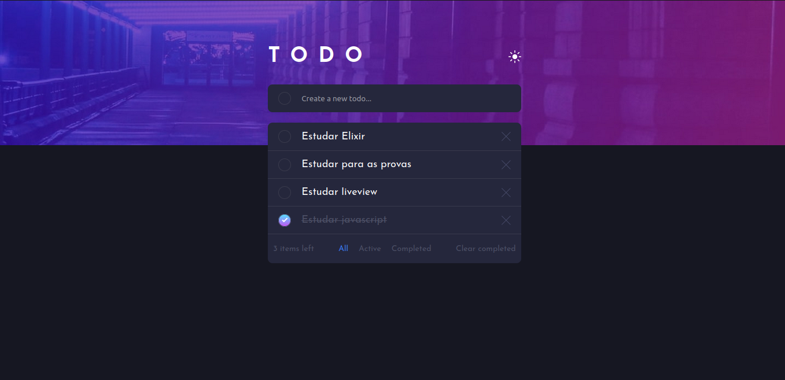

# Desafio Cross commerce

Para iniciar o servidor Phoenix:

- Instale as dependências com `mix deps.get`
- Inicie o endpoint com `mix phx.server` ou com o IEx `iex -S mix phx.server`

Agora é só visitar [`localhost:4000`](http://localhost:4000) no seu navegador.

### O desafio

Os usuários devem ser capazes de:

- ~~Ver um layout otimizado para a tela de seu dispositivo~~
- ~~Ver estados de "hover" para todos os elementos interativos~~
- ~~Adicionar novas tarefas à lista~~
- ~~Marcar tarefas como concluídas~~
- ~~Deletar tarefas da lista~~
- ~~Filtrar as tarefas por todas/ativas/completas~~
- ~~Limpar todas as tarefas completas~~
- Trocar entre modo escuro e claro
- **Bonus**: Arrasta e solta para reorganizar as tarefas

### Screenshot

## Meu processo

### Construído com

- Elixir
- Phoenix LiveView
- CSS
- CSS Grid
- Javascript

### O que eu aprendi

Esta foi a primeira vez que programei em Elixir na vida e, por consequência a primeira vez que programei utilizando um framework Elixir. Então, em resumo, num perído de mais ou menos uma semana consegui aprender o suficiente de uma nova linguagem e um framework para implementar este desafio.

Uma experiência um tanto complicada, porém foi agradável e no fim me inseri no universo da linguagens funcionais.

### O que poderia ter feito

Infelizmente, como já tinha que aprender uma nova linguagem do zero (junto de um framework), não consegui ter tempo de implmentar certas coisas, como componentização de elementos no LiveView, troca de tema e testes automatizados. Mas creio que com mais tempo tudo isso seria totalmente possível.
